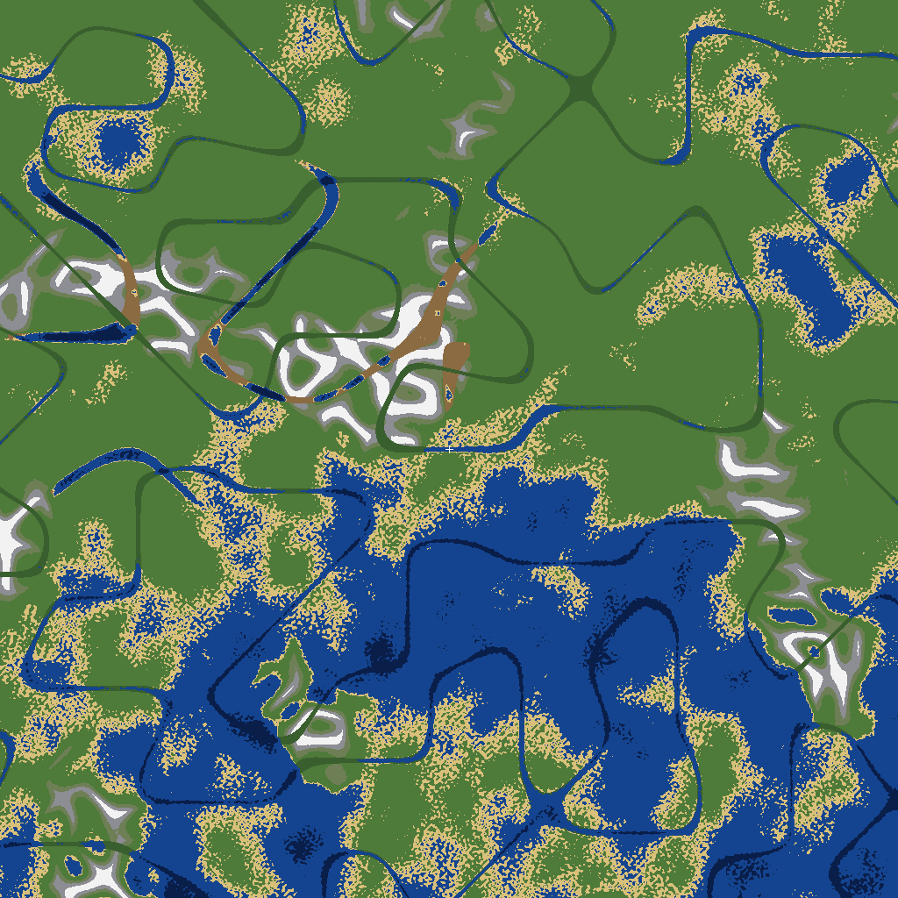

# ForgeWorldGen


[](https://papermc.io)
[](https://adoptium.net)
[](LICENSE)

A custom Minecraft world generator built as a **staged pipeline**: small,
single-purpose generation stages (terrain → surface → …) running over a
deterministic, seed-derived terrain engine. Volcanoes with lava-crater lakes,
epic mountain ranges, carved river valleys, and scabland coulees — with our
own biome model mapped to vanilla derivatives so vanilla decorations,
structures, and mob spawning keep working untouched.

*Not affiliated with MinecraftForge. "Forge" here is the author name.*

## How it works

```
generateNoise → TerrainStage → bedrock, stone/basalt body, oceans, crater lava
generateSurface → SurfaceStage → dithered biome borders, per-biome palettes
                → TreeStage → huge oaks, pines, redwoods, palms (border-safe)
                → DecorationStage → grass, flowers, mushrooms, moss, berries…
BiomeProvider → ForgeBiome → vanilla derivative (vanilla systems see vanilla)
```

- **Deterministic.** Every noise field derives from the world seed via
  `SeedManager` (splitmix64 domains). `/fgen verify <seed>` prints a SHA-256
  over the heightmap — same seed, same hash, on any server.
- **Staged.** `GenStage` is a one-method interface; the pipeline runs noise
  stages in `generateNoise` and surface stages in `generateSurface`. v3.1
  added `TreeStage` and `DecorationStage`; a custom `CarveStage` and
  continuation-safe object placement remain future work.
- **Vanilla where it counts.** Caves, decorations, structures, and mobs stay
  vanilla (config-toggled). Our biomes each declare a vanilla derivative, so
  a `VOLCANIC` biome reads as `STONY_PEAKS` to vanilla systems.


*Top-down render of seed 12345 (4096×4096 blocks): oceans, beaches, a major
mountain range, river valleys, scabland flats.*

## Commands (`/fgen`)

| Command | Permission | Description |
|---|---|---|
| `/fgen create <name> [seed]` | `fgen.admin` | Create a ForgeWorldGen world |
| `/fgen tp <world>` | `fgen.tp` | Teleport to a world |
| `/fgen pregen <world> <radius>` | `fgen.admin` | Pre-generate chunks (spiral, live speed readout) |
| `/fgen cancel` | `fgen.admin` | Stop a running pre-generation |
| `/fgen reload` | `fgen.admin` | Reload config, rebuild engines live |
| `/fgen verify [seed]` | `fgen.admin` | Determinism hash for a seed |
| `/fgen biome` | `fgen.tp` | Inspect the biome at your feet |

## Permissions

- `fgen.admin` (default: op) — create, pregen, cancel, reload, verify
- `fgen.tp` (default: op) — teleport, biome inspection

## Configuration (`config.yml`)

```yaml
generation:
  sea-level: 62                 # ocean level
terrain:
  mountain-amplification: 1.0   # 0.0–2.5, mountain range height
  volcano-rarity: 0.06          # 0.0–1.0 chance per 1536-block cell
  ruggedness: 1.0               # 0.0–2.0 medium detail (gated to land)
  rivers: true                  # carved river valleys
  scablands: true               # coulee channels on plateau country
vegetation:
  custom-trees: true            # huge oaks, pines, redwoods, palms
  tree-density: 1.0             # 0.0–3.0
  decorations: true              # grass, flowers, mushrooms, moss, berries…
  decor-density: 1.0            # 0.0–3.0
features:
  caves: true                   # vanilla cave carvers
  decorations: true              # vanilla ores, trees, flowers…
  structures: true               # vanilla structures
  mobs: true                    # mob spawning
world:
  auto-manage: true             # re-attach generator on restart
```

## Biomes

Plains, Forest, Desert, Mountains, Volcanic, Scabland, Ocean, Deep Ocean,
Beach, River, Snowy — each with a hand-tuned surface palette and a vanilla
derivative (e.g. Volcanic → Stony Peaks, Scabland → Savanna).

## Building

Direct-javac build (no Gradle daemon needed):

```bash
./build.sh   # → ForgeWorldGen-3.1.0.jar
```

Requires JDK 25 and the Paper 26.3 API jars in `~/workspace/.toolchains/paper-deps`
(see `build.sh`). Compiled with `-Werror -Xlint:deprecation`, nullness
annotations throughout, zero deprecated APIs.

## Design notes

See [DESIGN.md](DESIGN.md) for the architecture (the five ideas taken from
studying Iris's engine, reimplemented here in original code — no Iris/VolmLib
source is used or vendored).
